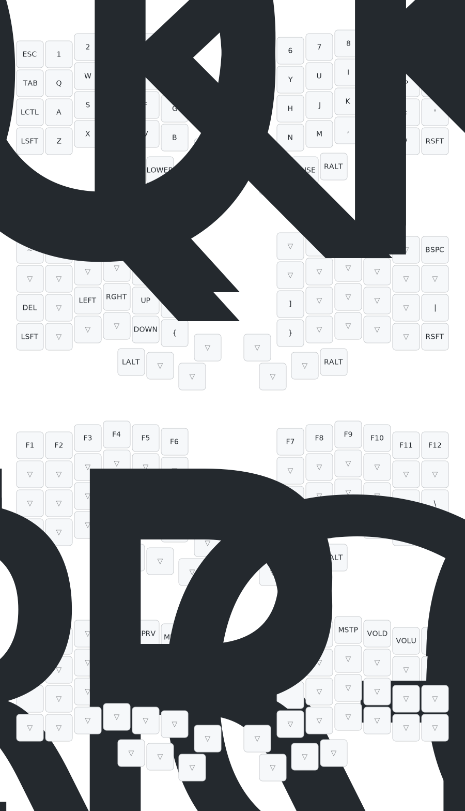

# Iris QMK Firmware 

These are all of the relevant files to build my keymap for the Keebio Iris 

You can use the image below to reference what the keymap looks like 

**NOTE:** Overrides are not shown in the visualizer

